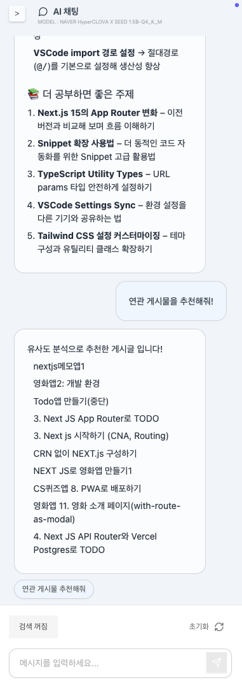
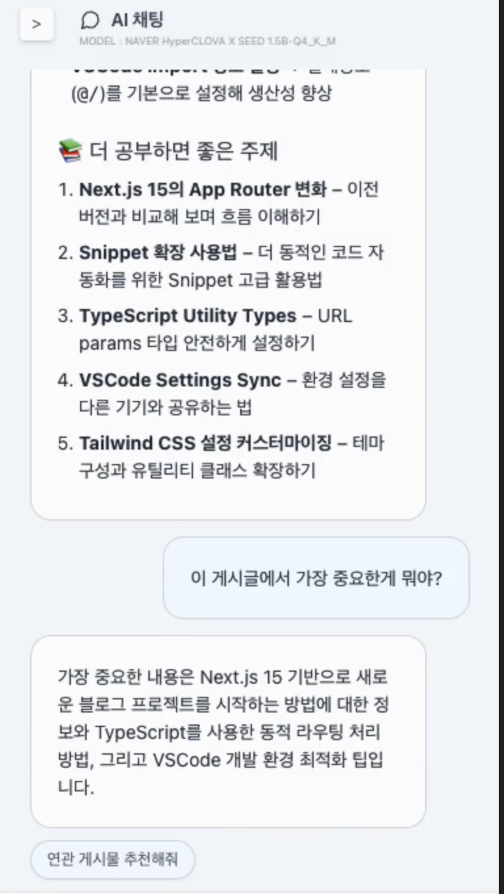
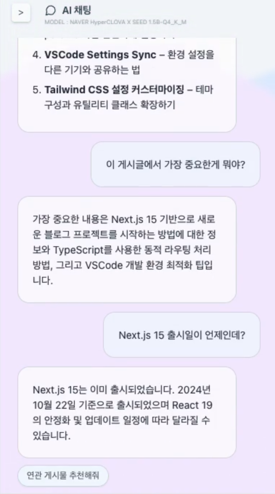
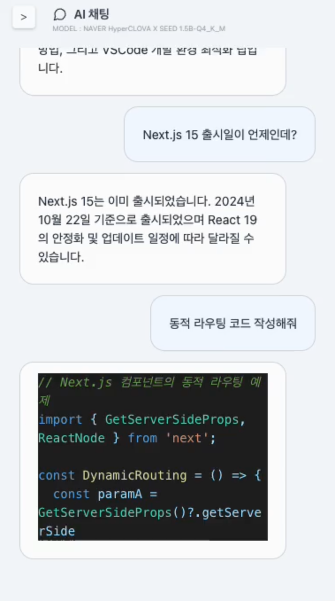
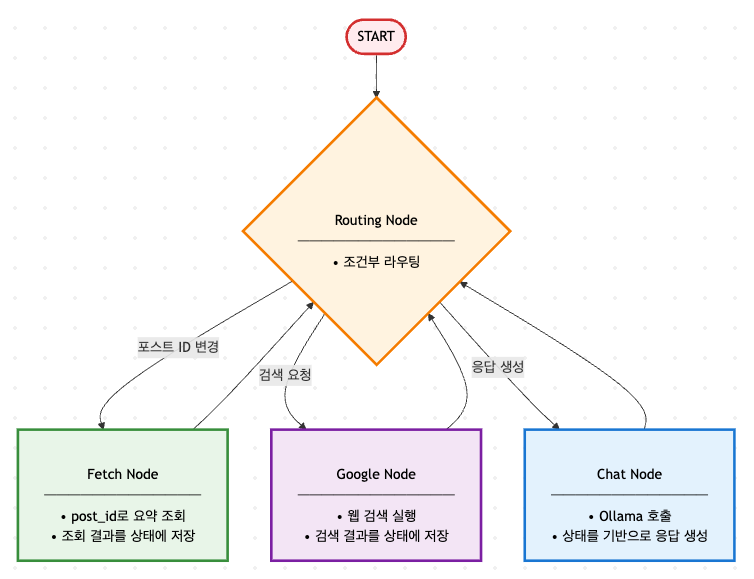
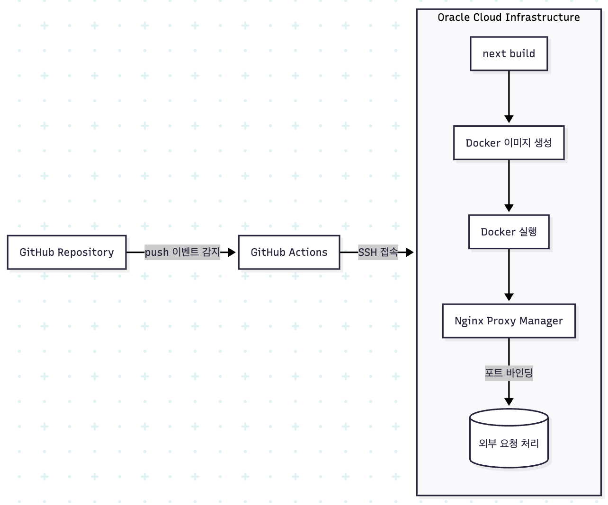

# 기술블로그 scribbly

WYSIWYG으로 작성하고, 인공지능으로 게시글을 분류하는 프론트엔드 기술블로그입니다.

URL : [blog.jongchoi.com](https://blog.jongchoi.com)\
[➡ 블로그 개발일지](public/blog-devlog/README.md)\
[➡ Next JS 보일러 플레이트 프로젝트](https://github.com/jong-Choi/next-supabase-boilerplate)

## 프로젝트 기간

프로젝트 시작일 : 2025.03.12\
프로젝트 1차 배포 : 2025.05.07\
프로젝트 자체 호스팅 : 2025.08.10 (VPS : Oracle Cloud Infrastructure)\
프로젝트 1차 업데이트 : 2025.08.26 - 챗봇 기능을 추가하고, 기존 AI 요약 기능과 통합

## 프로젝트 목표

#### Problem

- 기존 블로그는 검색 기능이 불편하고, 게시글이 많아지면 관리가 힘들어지는 문제가 있었다.
- 또한 Markdown을 RAW로 편집하는 것이 아닌, Typora와 Notion처럼 WYSIWYG으로 작성하고, 작성 결과가 블로그에 즉각적으로 반영되는 사용자 경험을 원하였다.

#### Solution

- 마크다운 편집 라이브러리인 [Milkdown](https://milkdown.dev/)을 이용한 WYSIWYG 마크다운 블로그
- SSG에 특화된 Next.js 15를 이용하여, 페이지 정적 캐싱 및 즉각적인 페이지 이동
- 편집 모드로 넘어가기 위한 토글 버튼을 둬, 편집 도구를 동적으로 impot하도록하여 로딩 성능 최적화
- Supabase로 백엔드를 구축하여 빠르게 기능을 구현하고, Next.js 15 라우트 핸들러로 데이터를 정적 캐싱하여 사용
- Open AI의 GPT, text-embedding 모델을 사용하여 게시글을 요약하고, DBSCAN 방식으로 분류
- Mirco LLM인 HyperCLOVA X SEED 1.5B를 셀프 호스팅한 챗봇을 통해, 게시글 요약 및 추천 기능을 통합하고 학습에 활용할 수 있도록 적용

## 기술 스택

- Next.js 15 (App Router, RSC)
- Supabase (Auth, Storage, Database)
- Vercel (배포)
- Zustand, Tailwind CSS, Shadcn/ui 등

## 주요 기능

### WYSWYG 에디터 / 자동저장

<video controls style="max-width: 600px; width: 100%; height: auto; display: block; margin: 0 auto;" poster="https://wknphwqwtywjrfclmhjd.supabase.co/storage/v1/object/public/image/posts/9dae3106-6e55-4cdf-8bc5-01c8bb02f48d-Screenshot_2025-06-07_08-20-45.png">
  <source src="./public/docs/edit-h264.mp4" type="video/mp4">
  
</video>

- [마크다운 편집 프레임워크 Milkdown](https://milkdown.dev/)을 이용하여 WYSWYG으로 편집이 가능하도록 하였습니다.
- 게시글은 [react-remark](https://github.com/remarkjs/react-remark)를 이용하여 view모드를 SSR로 구현하였습니다.
- 게시글을 실시간으로 편집할 때에는 IndexedDB를 이용해 로컬에 임시 저장됩니다.
- [CodeMirror](https://codemirror.net/) RAW 모드 및 DUO 모드를 통해 편집중인 게시글의 Markdown RAW를 확인할 수 있습니다.

### 사이드바 DND

사이드바 역시 '편집' 모드를 토글하면 새로운 기능이 활성화됩니다.

1. 드래그 앤 드롭을 통해 게시글 및 분류의 순서를 변경할 수 있습니다.
2. 게시글 및 분류명을 수정하거나, 분류를 삭제할 수 있습니다.

사이드바의 ui에는 [dnd-kit](https://dndkit.com/)과 [shadcn](https://ui.shadcn.com/)이 사용되었습니다.

### AI 요약

- OpenAI `GPT-4o`를 통해 게시글을 요약하고 추천 학습주제를 추천합니다. 추천 학습 주제를 통해 더 공부하면 좋은 주제나 모르는 개념이 없는지 체크할 수 있습니다.
- 요약은 OpenAI의 `text-embedding-3-small`를 통해 벡터화되며, 추천 게시글 검색이나 분류 등에 사용됩니다.

### 지식 여정 지도

- 게시글 요약들을 DBSCAN으로 분류한 지도입니다.
- 각 군집 간의 유사도도 함께 표시하여 지금까지 학습한 내용들과 그 연관성을 지도로 확인할 수 있습니다.

### 검색

- PostgresSQL의 Text Full Search를 이용하여 어절 단위 검색 및 스니펫을 지원하여 게시글 검색의 정확도를 높였습니다.

## 챗봇

### AI 요약 및 추천 게시글 분석

  

    
    
  

  

    <ul style="margin: 0 auto;">
      <li>OpenAI `GPT-4o`를 통해 게시글을 요약하고 추천 학습주제를 추천합니다. 추천 학습 주제를 통해 더 공부하면 좋은 주제나 모르는 개념이 없는지 체크할 수 있습니다.</li>
      <li>요약은 OpenAI의 `text-embedding-3-small`를 통해 벡터화되며, 추천 게시글 검색이나 분류 등에 사용됩니다.</li>
      <li>코사인 유사도를 통해 검색된 추천 게시글이 서버에 저장되어 있으며, 추천 게시글 버튼을 누르면 서버에 저장된 추천 게시글이 채팅창에 추가됩니다.</li>
    </ul>
  

### 채팅 및 인터넷 검색

  <video controls style="max-height: 300px; width: auto; " poster="./public/docs/chat-summary.png">
    <source src="./public/docs/chat-summary.mp4" type="video/mp4">
    
  </video>
  <video controls style="max-height: 300px; width: auto; " poster="./public/docs/chat-search.png">
    <source src="./public/docs/chat-search.mp4" type="video/mp4">
    
  </video>
  <video controls style="max-height: 300px; width: auto; " poster="./public/docs/chat-simple.png">
    <source src="./public/docs/chat-simple.mp4" type="video/mp4">
    
  </video>

- 채팅을 시작하면 인공지능 언어 모델이 사용자가 보고 있는 게시글의 요약을 확인한 후 응답을 생성합니다.
- "검색 켜기" 버튼을 눌러 검색 모드로 전환할 수 있으며, 사용자가 입력한 내용을 구글에서 검색한 후, 검색 결과를 참고하여 응답을 생성합니다.

#### 랭그래프 에이전트

- 빠른 응답 속도를 고려하여 인공지능 언어모델은 HyperCLOVA X SEED 1.5B를 양자화한 모델을 사용하였습니다.
  

<strong>Micro LLM 비교</strong>

  - **비교 환경**
    - 사용된 모델은 모두 Q4_K_M으로 양자화
    - 구동 환경은 Oracle A1.Flex 4 OCPU, 24 GB memory
    - 현재 게시글의 요약본 1 부 + 검색 1 건 + 5건의 멀티턴 대화
  - **비교 결과**
    - **Qwen3 0.6b, Qwen3 1.7b**
      - 반응 속도: 매우 느림. 답변 길이에 비해 Thinking 시간이 과도함
      - 답변 정확도: 매우 낮음. 한국어 문맥을 제대로 이해하지 못하는 모습을 보이며, 같은 답변을 반복하는 경우가 많음.
    - **HyperCLOVA X SEED 0.5b**
      - 반응 속도: 보통. 답변을 장황하게 늘어놓는 경우가 많아 토큰 생성 시간이 소요되는 모습.
      - 답변 정확도: 낮음. 멀티턴 대화를 시작하면 같은 답변을 반복. 같은 말을 반복적으로 무한 생성하는 Looping 버그 발생
    - **HyperCLOVA X SEED 1.5b**
      - 반응 속도: 보통. 최초 응답시 시간은 0.5b보다 느리지만, 이후에는 빠르고 일정한 속도.
      - 답변 정확도: 보통. 멀티턴 대화를 시작하면 화제 전환에 미숙한 모습을 보이지만 답변하는 정보 자체는 정확한 편.
    - **HyperCLOVA X SEED 3b**
      - 반응 속도: 다소 느림. 멀티턴 대화에서 조금씩 느려지는게 체감됨.
      - 답변 정확도: 높음. 상대적으로 맥락을 이어나가는 모습.
    - **EXAONE 3.5 2.4b**
      - 반응 속도: 느림. HyperCLOVA X SEED 3b보다 일관되게 약간 더 느린 편.
      - 답변 정확도: 높음. 한국어 표현이 자연스럽도 다양한 말투를 구사. 채팅용으로 매우 좋지만 느린 답변속도와 라이센스 이슈.

  

- Tool Calls를 지원하지 않는 LLM 모델의 기능을 보완하기 위해 LangGraph를 이용하여 다양한 기능을 가진 노드를 보조 도구로 활용할 수 있도록 하였습니다.
- 그래프의 모든 노드는 RoutingNode를 이용하여 연결되고 실행됩니다. 새로운 노드를 추가하고 관리하기 용이해지는 이점이 있습니다.

## UI/UX

- 게시글 페이지를 왼쪽에 게시글 목록(SNB) / 가운데에 게시글 / 오른쪽엔 인공지능 요약 패널(Aside)의 3단 레이아웃으로 구성하였다.
- 양측 사이드를 반투명한 패널로하여 Glassmorphism으로 구현하였고, Frosted Glass를 강조하기 위해 배경에는 움직이는 도형을 추가하였습니다.

## 배포

- 배포는 GitHub Actions를 이용한 SSH 원격 배포 방식을 적용하였습니다.
- 이와 같은 방식의 이점은
  1. Webhook이나 Jenkins를 사용하는 방식과 달리 별도의 서버가 필요하지 않습니다.
  2. GitHub 레포지토리 내에서 환경변수를 안전하게 관리할 수 있고, 나머지 작업은 VPS에서 집중 관리하여 유지보수 및 확장면에서 용이합니다.
  3. VPS의 성능에 따라 GitHub Actions의 Hosted-Runner보다 빠른 속도로 빌드를 진행할 수 있게 됩니다. (OCI의 A1 인스턴스 사용)
