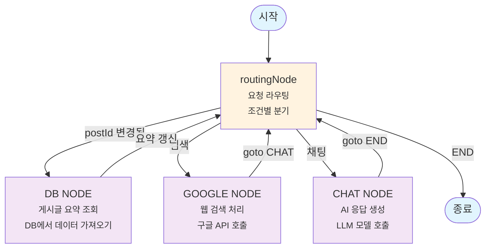

# LangGraph 아키텍처 다이어그램

## 전체 플로우 다이어그램



## 상태 구조

```typescript
SessionMessagesAnnotation = {
  messages: BaseMessage[],        // 대화 메시지 배열
  routeType: LangNodeKeys,       // 라우팅 타입 ("chat" | "google" | "")
  postId: string | undefined,    // 현재 게시글 ID
  postSummary: {                 // 게시글 요약 캐시
    id: string,
    summary: string
  } | null
}
```

## 노드별 세부 기능

### 1. routingNode (라우팅 노드)

- **역할**: 요청 타입에 따른 다음 노드 결정
- **로직**:
  - `postId` 변경 감지 → `fetchSummaryNode`로 이동
  - `routeType`에 따라 해당 노드로 분기
  - 유효하지 않은 경우 종료

### 2. fetchSummaryNode (요약 가져오기 노드)

- **역할**: 게시글 요약 데이터 가져오기
- **플로우**: `fetchSummaryNode` → `routingNode`

### 3. chatNode (채팅 노드)

- **역할**: 일반 채팅 처리
- **플로우**: `chatNode` → `routingNode`

### 4. googleNode (구글 검색 노드)

- **역할**: 구글 검색 기능 처리
- **플로우**: `googleNode` → `routingNode`

## 실행 흐름 예시

```mermaid
sequenceDiagram
    participant User
    participant START
    participant Routing
    participant FetchSummary
    participant Chat
    participant END

    User->>START: 채팅 요청 (postId: "123")
    START->>Routing: 라우팅 시작

    alt postId 변경됨
        Routing->>FetchSummary: 요약 가져오기
        FetchSummary->>Routing: 요약 완료
    end

    Routing->>Chat: 채팅 처리
    Chat->>Routing: 응답 생성
    Routing->>END: 완료
    END->>User: 최종 응답
```

## 주요 특징

- **상태 기반 그래프**: 각 노드가 상태를 공유하고 수정
- **동적 라우팅**: `routingNode`가 조건에 따라 다음 노드 결정
- **순환 구조**: 대부분의 노드가 `routingNode`로 돌아와 연속 처리 가능
- **메모리 저장**: `MemorySaver`를 사용한 상태 저장
