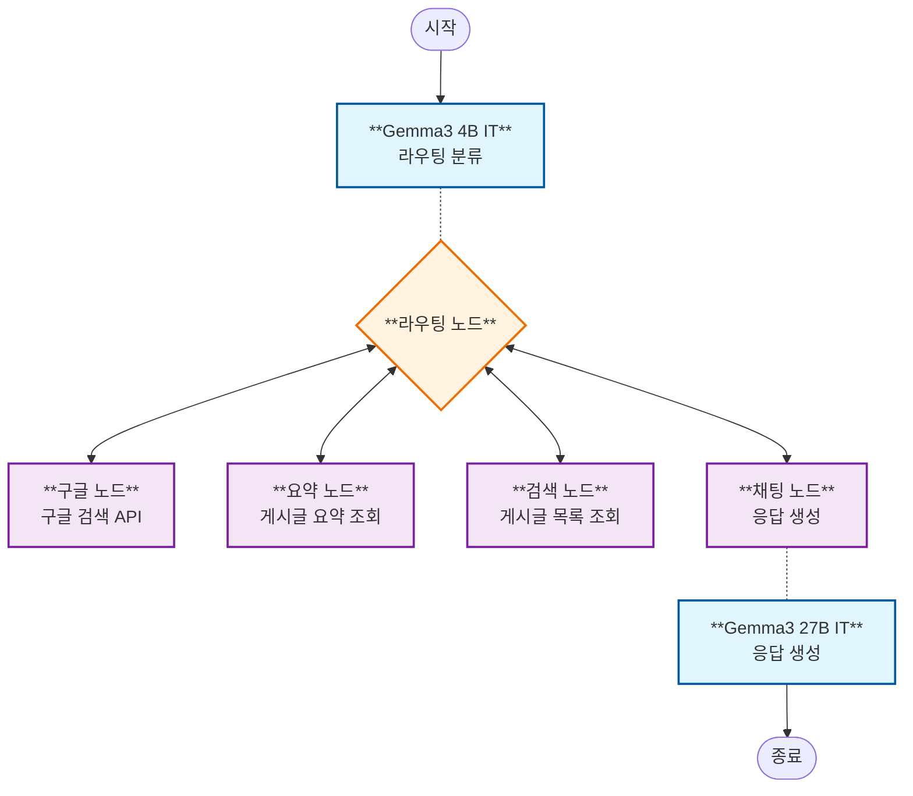

# LangGraph v2 채팅 API 아키텍처 다이어그램

## 개요

LangGraph와 Gemma3 모델을 사용한 업데이트된 채팅 API 아키텍처 다이어그램입니다.

## 아키텍처 구성 요소

### AI 모델

- **Gemma3 4B IT**: 라우팅과 분류를 위한 경량 모델
  - 사용자 의도 파악을 위한 빠른 응답
  - 효율적인 라우팅 결정을 위한 200 토큰 제한
  - 빠른 분류를 위한 비스트리밍 방식
- **Gemma3 27B IT**: 채팅 응답을 위한 강력한 모델
  - 고품질 대화형 응답
  - 상세한 응답을 위한 2048 토큰 제한
  - 더 나은 사용자 경험을 위한 스트리밍 활성화

### 노드 플로우

1. **시작** → 사용자 메시지가 그래프에 입력됨
2. **라우팅 노드** → Gemma3 4B가 의도를 분류함
3. **전문 노드들** → 특정 작업 처리:
   - 채팅: 직접 대화
   - 구글: 웹 검색 쿼리
   - 요약: 블로그 포스트 요약
   - 블로그 검색: 내부 콘텐츠 검색
4. **루프백** → 대부분의 노드가 후속 처리를 위해 라우팅으로 돌아감
5. **종료** → 대화 종료

### 상태 관리

그래프는 노드 간에 다음 상태를 유지합니다:

- 메시지 히스토리
- 라우팅 결정
- 쿼리 컨텍스트
- 포스트 참조
- 생성된 요약

## 주요 기능

- **멀티 모델 아키텍처**: 서로 다른 작업에 최적화된 모델들
- **순환 그래프**: 다중 턴 대화를 위한 노드 루프백
- **상태 지속성**: 대화 컨텍스트를 유지하는 메모리 저장
- **유연한 라우팅**: 사용자 의도 기반 동적 라우팅
- **스트리밍 지원**: 채팅 노드를 위한 실시간 응답 전달
